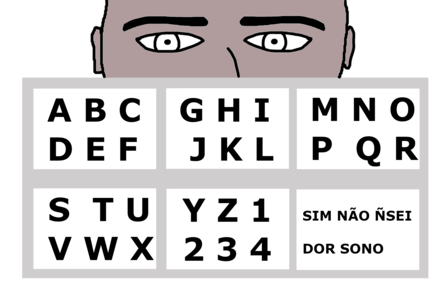
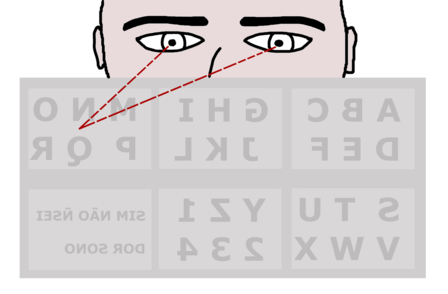
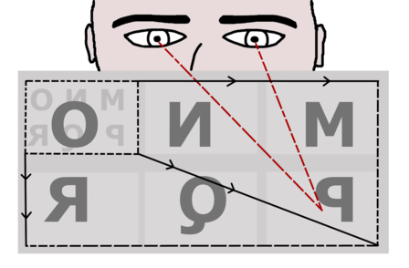

# Projeto Mara

O **Projeto Mara** foi desenvolvido com o objetivo de aprimorar a comunicação de pessoas que sofrem de esclerose lateral amiotrófica (ELA), uma doença neurológica que afeta o funcionamento dos neurônios motores, levando à progressiva perda de movimento dos membros, culminando na paralisia total. Essa paralisia ocorre de baixo para cima no corpo, deixando os músculos oculares como os últimos a serem afetados. É importante notar que os neurônios sensoriais permanecem funcionando normalmente, permitindo que os pacientes ainda sintam sensações de toque, dor, temperatura e posição dos membros.

## Comunicação com Pacientes

Existem vários métodos de comunicação com pacientes com ELA, e um deles envolve o uso de um quadro com o alfabeto disposto em quadrantes. O processo para escolher a letra __P__, por exemplo, é o seguinte:

1. Um acompanhante ou profissional de saúde posiciona o quadro na frente do paciente, que olha diretamente para ele.


2. O paciente seleciona um quadro que contém a letra desejada olhando em sua direção.


3. Como se o quadro aumentasse de tamanho, o paciente seleciona uma letra olhando na direção do quadrante que contém a letra escolhida.


## Projeto Mara - Versão 2

O **Projeto Mara** foi recentemente atualizado para a sua versão 2, que utiliza as tecnologias do [Tailwind CSS](https://tailwindcss.com/) e [React](https://react.dev/) para melhorar a escalabilidade do código, além de um novo ambiente de calibração da biblioteca de detecção de olhar o [WebGazer.js](https://webgazer.cs.brown.edu/). O projeto permite que os pacientes usem um teclado virtual que simula o quadro físico, facilitando a comunicação por meio do movimento dos olhos. Com a ajuda de um computador ou tablet com câmera, os pacientes podem escrever e pronunciar textos de forma autônoma por meio desta aplicação web.

Para mais informações sobre a versão anterior do projeto, visite o [repositório anterior](https://github.com/jpbetanza/Mara).

### Ambiente de calibração
> 
### Digitação
> 

## Experimentar o projeto

Há duas maneiras de iniciar o projeto, a primeira delas é acessando o site hosteado pelo vercel: [Mara](https://mara2.vercel.app/)

A outra maneira é rodando o código localmente em sua máquina! Certifique-se de que possui o [git](https://git-scm.com/) e o [nodejs](https://nodejs.org/en/download/) instalados em seu computador.

- Clone o repositório em uma pasta de seu agrado, navegue para a pasta e abra o servidor local:

```
git clone https://github.com/jpbetanza/Mara2.git
cd Mara2
npm run dev
```

## Feito com

* [TailwindCSS](https://tailwindcss.com/) - Framework CSS
* [React](https://react.dev/) - Framework Front End
* [WebGazerJS](https://webgazer.cs.brown.edu/) - Biblioteca de rastreio ocular

## Autor

* **João Pedro Betanza** - [jpbetanza](https://github.com/jpbetanza)

